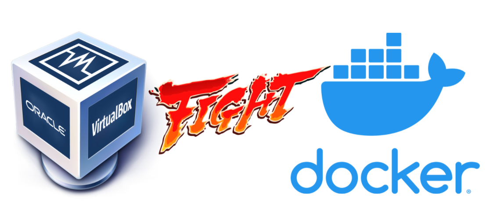
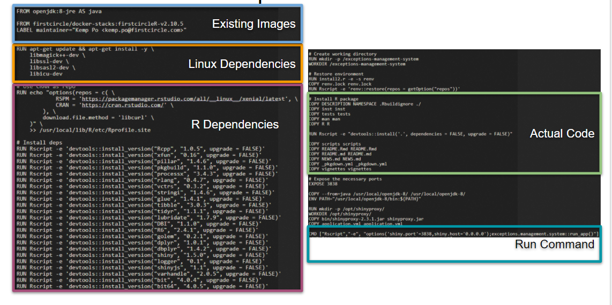

Title: Containers and how to use them
Date: 2020-10-20 00:00
Category: Blog
Tags: Docker, Best practices, Containers
Slug: containers-and-how-to-use-them
Authors: Kemp Po
Summary: Introduction to Containerization and Docker. A brown bag I gave to the engineering team at First Circle

Every developer has probably encountered this:
> "It worked on my machine". 

Fear not! We already have a solution to this problem and they're called
containers. No, not the enormous amount of plastic every Asian mom keeps 
somewhere in the kitchen.

### What are containers?
They're meant to package up and hold the code and its dependencies like how the
plastic ones hold your food, instead of you holding it in your hands. It enables
you run your applications reliably and easily in different environments. 
Containers are lightweight, standalone, executable packages of software that 
contains everything needed to run the programs you've created. Containers even
have their own filesystems!

These containers have to be created somehow through these blueprints, which we
call **images**. Images are essentially schematics that define a filesystem, 
the code or binary, runtimes, dependencies, and any other thing required to run
the code. Without an image, there is no container. 

Now that we know what containers are,
### Why containers?
We actually have different options of solving the problem, so let's weigh one of
the largest contenders to containers, the Virtual Machines or VMs. Virtual 
Machines originally started because servers processing power increased and
normal applications aren't able to maximize these resources. This, however,
introduced a new issue, portability.

### Containers vs Virtual Machines

Some key differences between containers and virtual machines are:

| Features | Containers | Virtual Machines |
| -------- | ---------- | ---------------- |
| Operating System | Runs just a portion of an OS, uses less system resources and can be tailored to what is needed | Runs a complete OS, including the kernel, thus using up more system resources |
| Guest Compatibility | Needs to run the same OS verion as the host | Runs almost any OS |
| OS Updates | All you need to do is update the image build file, rebuild the image and redeploy | You will need to update every VM instance or recreate them |

The key advantage of the Virtual Machine is that allows any OS to run on top of the host machine. The Guest OS has virtual access to the host's resources. This, however, means that there's a lot of overhead needed to run the VM and runs slower on lower end machines. 

Containers, on the other hand, are just discrete processes. They share the host machine's kernel and thus needs to use the same OS as the host. It is considered to be flexible, lightweight, portable, loosely coupled, scalable, and secure. You can build the container locally, deploy to the cloud and run the container on any machine with Docker. Containers are also easily scalable due to them being built with images. This means that it can be easily replicated and distributed.

### How to get started with Docker?
1. Install Docker.
Docker works on Windows, macOS, and Linux. 
2. Create a Dockerfile in the directory you're working on
There are several parts to a Dockerfile.

    1. A base image is always the suggested way of building your docker images. Many times someone has already built an image with all the dependencies you would probably need. For R, I usually use something from [Rocker](https://github.com/rocker-org/rocker). For Python, I would use [Jupyter](https://hub.docker.com/u/jupyter) if it's a notebook I'm dealing with, but most of the time I just take one of the images from the [Docker official image for Python](https://hub.docker.com/_/python). There's many base images out there for you to use. 
   
    2. The next part would probably be the dependencies you need to run your code. This comes in two parts. The first, being the OS dependencies like for Linux you might need the SSL dependency. 
    
        Normally, you would probably be using packages that other people have already built and you want that available to your app at runtime, so the second part is your code's actual dependencies. In my example here, I installed a bunch of R dependencies like [dplyr](https://dplyr.tidyverse.org/index.html). For Python, this would be in the form of reading a `requirements.txt` and installing all those in the file.

    3. The path to your code needs to be included in the Dockerfile definition. You would do this by performing some `COPY` commands where you copy only the necessary directories. 
    
        You could just copy everything by doing `COPY . .`, but this is not recommended. We want to keep our image as lightweight as possible shedding any possible files unneeded to run the application. We could also define a `.dockerignore` file which works much like a `.gitignore` file. 

    4. The final part of the Dockerfile is going to be your container start command. This could come in the form of `CMD` or `ENTRYPOINT`. The key difference betweeen the two is that `CMD` is a default command that can be overriden easily. `ENTRYPOINT`, on the other hand, is the choice when you want to start the container with a specific executable. The only way to override the `ENTRYPOINT` command is to pass an `--entrypoint` flag.
   
    

    You can make a lot of customizations to your Dockerfile and how it's run. Check out the documentation at [docs.docker.com](https://docs.docker.com/engine/reference/builder/)

3. Build the image by running `docker build -f Dockerfile --cache-from <image_cache> --tag <image_name> .`.
   Building the image is simple. All you need to do is run the `docker build` command. You can also pass different flags to it such as specifying which Dockerfile to use or what to tag the image with. Check out all the possible options on their [documentation](https://docs.docker.com/engine/reference/commandline/build/)

    A tip is to use the build-cache to making building new images much faster. This is the very reason why we put our code at the end of the Dockerfile. It is because Docker will use the build cache while it can until it detects a new change.

    Take this example. Only the first 2 lines will probably use the build cache because our code has changes. The install will not be cached.

        FROM python:3.9

        COPY requirements.txt .
        COPY . .

        RUN pip install -r requirements.txt

        CMD ["python", "run.py"] 
    

    The more efficient implementation of this would look like
        
        FROM python:3.9

        RUN pip install -r requirements.txt

        COPY requirements.txt .
        COPY . .

        CMD ["python", "run.py"] 

4. Run the built image by running the `docker run` command. We can 
   again pass extra flags to the command such as `--rm`, which automatically removes the container on exit. You can also pass environment variables to the container at runtime by addign a `-e` or `--env` flag to the command.  
   
    For all the possible flags, again check their [documentation](https://docs.docker.com/engine/reference/commandline/run/).

One trick I have personally found very useful is turning all these commands in to Make commands and using a standard pattern across all my projects. 

### Containers
- Use containers to ensure your applications can run almost anywhere.
- Use Dockerfiles to define an image for your containers.

Stay tuned for a piece on Kubernetes and how it's useful to a data engineer.
